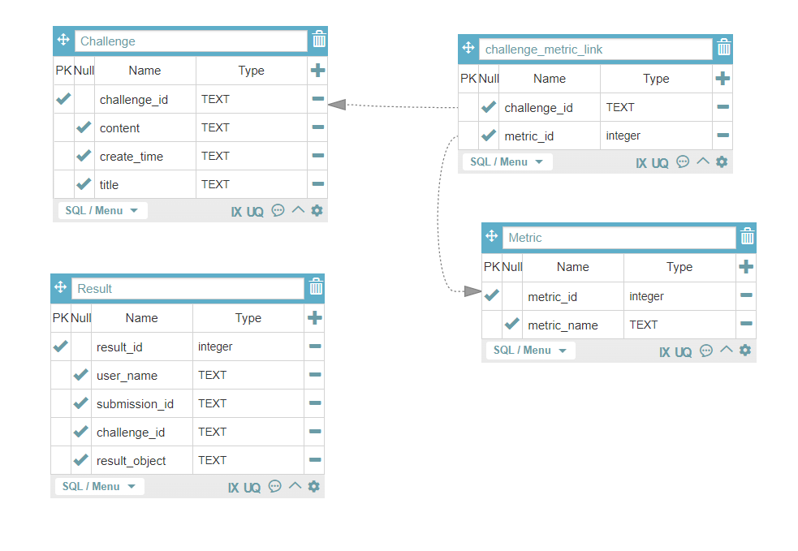

# simple api server

## Requirements
Python 3.9

## Usage
To run the server, please execute the following from the project root directory:
```
docker run -dp 6379:6379 redis:alpine  
python -m pip3 install -r requirements.txt
python -m celery -A evaluate_api.service.evaluator worker -l INFO --pool=solo &
python -m flask run
```
[web page](http://localhost:5000/)

## Test
To run tests, please execute the following from the root directory:
```
python -m pytest
```

## Swagger document
[swagger api document](http://localhost:5000/apis)  


## Running with Docker

To run the server on a Docker container, please execute the following from the root directory:

```
# starting up a container
docker-compose up
```

SQL 데이터베이스 구조  


## 최적화 방안:

결과물을 채점하는 과정에서 많은 연산과 병목현상이 발생할 것으로 예측된다
(소프트웨어 프로파일링을 실시해서 리소스 사용량 상위 20%정도의 코드들에 대해서
최적화를 하는것이 좋을 것이다.)
현재는 비동기 처리만 적용되어 있는데 이를 병렬처리해서 연산한다면 병목현상은
어느정도 해결 할 수 있을것이다.
또한 데이터를 페칭하는데서 생기는 딜레이는 케싱 인스턴스를 샤딩해서
스케일 아웃하는 방법으로 속도를 증가시킬 수 있을것이다.  
데이터에 대해서 영속적으로 보관해야 하는 데이터와 일시적으로 결과값만 제공하면
되는 데이터를 잘 분리해서,
영속적으로 보관해야 하는 데이터는 휘발성있는 메모리가 아닌 저장소에 저장하는것이 안정적일것이다.
만일 케싱데이터도 영속적으로 보관하고 싶다면 RedisDB를 덤프해서 하드디스크에 보관하는 방법도 있다.


